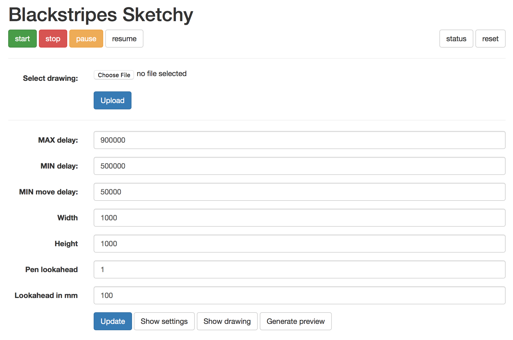

blackstripes-drawbot-driver
===========================

This is the driver we use at [blackstripes.nl](http://www.blackstripes.nl). It controls two stepper motors and a single solenoid for pen lifting. The main features are:

1. Direct SVG workflow. Upload svg to the Raspberry-PI through web based interface, no translation to g-code needed.
2. Speed managemment through web interface.
3. Automatic lookahead acceleration management.
4. Simple Lua scripting interface. `moveTo(x,y) penUp() penDown()`
5. Can control V-plotters as wel as other machines.
6. Standalone operation with a single Raspberry-PI

How to compile
==============

###On the Raspberry-PI

1. ######clone this repo
2. ######build the server
	1. cd to sketchy_server
	2. `make`
	3. `make install`
3. ######build the driver
	1. cd to sketchy_driver
	2. `make pi`
	3. `make install`
4. ######build the (optional) preview-driver
	1. cd to sketchy_driver
	2. `make preview`
	3. `make installp`
	
Now cd into the build directory and start the server.

`sudo nohup ./sketchy-server`

Now find out the IP-address of your Raspberry-PI and point your webbrowser to port 8000.
`(http://192.168.x.xxx:8000)` You should see this page:

	

### Cross compilation

For crosscompiling we have created a crosscompile target in the make files.
Our cross-compiling machine has these cross compiling tools installed:

####Toolchain
git clone https://github.com/raspberrypi/tools

You can then copy the toolchain to a common location such as 
/tools/arm-bcm2708/gcc-linaro-arm-linux-gnueabihf-raspbian, and add 
/tools/arm-bcm2708/gcc-linaro-arm-linux-gnueabihf-raspbian/bin to 
your $PATH in the .bashrc in your home directory. 
For 64bit, use /tools/arm-bcm2708/gcc-linaro-arm-linux-gnueabihf-raspbian-x64/bin. 
While this step is not strictly necessary, it does make it easier for later command lines!

To find out the lib path of this cross-coompiler you need to do this

$ arm-linux-gnueabihf-gcc -print-sysroot

this will show where to look for libc.

also:

$ arm-linux-gnueabihf-gcc -print-search-dirs
 
You need to have rpi compiled libs of xenomai and native. I got them from a xenomaied Raspberry pi from /usr/lib/

Then you need to copy these libnative.* and libxenomai.* files into this sysroot in the folder 
[sysroot compiler]/usr/lib/ 

That together with some modified targets for using the right compiler include path and you are ready to roll.

